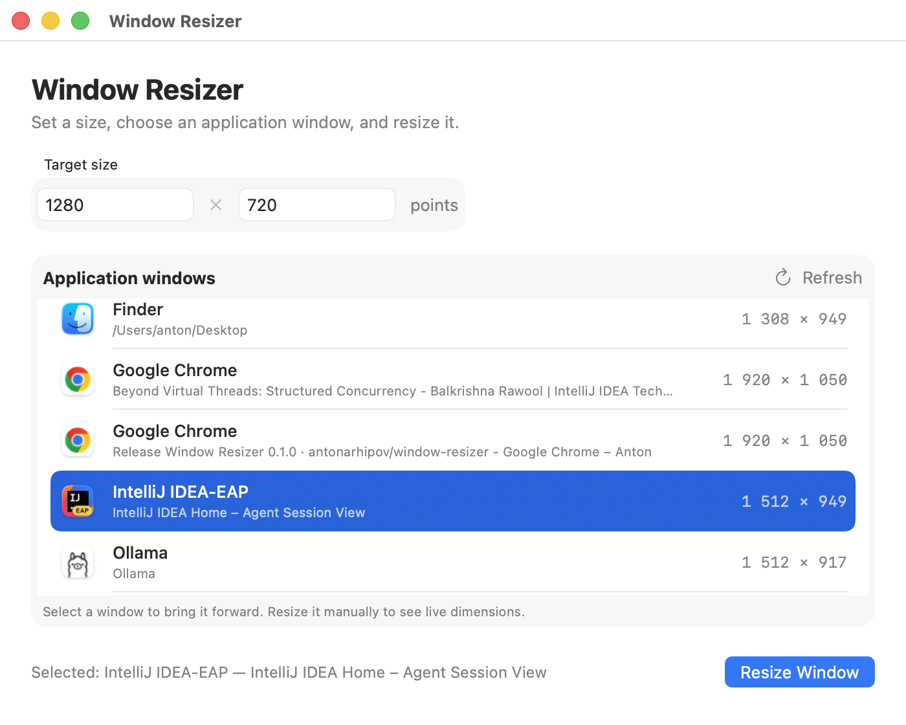

# Window Resizer

A small native macOS utility for resizing an individual application window to an exact width and height.

Current version: **0.1.0**



## Requirements

- macOS 14 Sonoma or later
- Accessibility permission to read, focus, and resize other applications' windows
- Apple silicon or Intel Mac; release builds contain both architectures

## Installation

### Install a release

1. Open the [latest release](https://github.com/antonarhipov/window-resizer/releases/latest).
2. Download `WindowResizer-<version>-macOS-universal.zip`. You can also download the adjacent `.sha256` file and verify the archive before opening it:

   ```sh
   shasum -a 256 -c WindowResizer-<version>-macOS-universal.zip.sha256
   ```

3. Double-click the ZIP to extract `WindowResizer.app`, then move the app to **Applications**.
4. Open **Window Resizer** from Applications.

If macOS says it cannot verify the developer, Control-click **Window Resizer**, choose **Open**, and confirm once. If **Open** is not offered, try launching the app once and then allow it under **System Settings > Privacy & Security > Open Anyway**.

### Grant Accessibility permission

1. In Window Resizer, choose **Open Accessibility Settings**.
2. Enable **Window Resizer** under **System Settings > Privacy & Security > Accessibility**. If it is not listed, use the **+** button and select the copy in Applications.
3. Return to Window Resizer. The app checks access automatically; choose **Check Access Again** if the permission screen remains visible.

Window Resizer needs this permission because macOS only exposes other applications' window positions and sizes through the Accessibility APIs.

## User guide

### Resize a window to an exact size

1. Open the application window that you want to resize.
2. Enter the target **Width** and **Height** in Window Resizer. Values are whole macOS points from 1 to 16,384.
3. Find the window under **Application windows**. Choose **Refresh** or press **Command-R** if a newly opened window is missing.
4. Select the window row. Window Resizer restores the window if it is minimized, brings it to the front, and briefly displays its dimensions.
5. Choose **Resize Window**. The status message reports the size the target application actually accepted.

The list contains individual windows, not just application names. Use the window title shown below the application name when an application has several windows open.

### Resize manually with the dimension hint

1. Enter your intended target size and select the window in the list.
2. Drag an edge or corner of the selected application window.
3. Use the floating hint to watch the current width and height. It also shows the configured target and displays a checkmark when the window is within one point of it.

The hint follows the selected window while its size changes and fades shortly after resizing stops. The dimensions in the application list update as you resize.

### Window-size limitations

Dimensions are expressed in macOS points rather than physical display pixels. Applications can enforce minimum sizes, maximum sizes, fixed aspect ratios, or other constraints. When an application rejects the exact requested dimensions, Window Resizer reports the size it used instead.

## Troubleshooting Accessibility access

Accessibility access is tied to the exact signed copy of an application. If access is enabled but Window Resizer still asks for it:

1. Quit Window Resizer.
2. Remove the existing **Window Resizer** row from **System Settings > Privacy & Security > Accessibility**.
3. Use the **+** button to add the exact `WindowResizer.app` copy that you intend to run.
4. Enable that row and reopen the same application copy.

Rebuilding the app locally changes its ad-hoc signature, so macOS may require you to grant access again after each rebuild.

## Build from source

Clone the repository and create an optimized universal app:

```sh
git clone https://github.com/antonarhipov/window-resizer.git
cd window-resizer
./Scripts/build-app.sh
```

The app is created at `build/WindowResizer.app`. You can also open `WindowResizer.xcodeproj` in Xcode, select the **WindowResizer** scheme, and run it.

Build and test from Terminal with:

```sh
xcodebuild -project WindowResizer.xcodeproj -scheme WindowResizer build
xcodebuild -project WindowResizer.xcodeproj -scheme WindowResizer test
```

Set `WINDOW_RESIZER_BUILD_CONFIGURATION=Debug` when running `Scripts/build-app.sh` to create an unoptimized local build.

## Privacy and security

Window Resizer is intentionally not sandboxed because macOS Accessibility APIs must communicate with other applications' windows. It does not use the network or persist a history of window titles.

## Releases

CI builds and tests the app on pushes and pull requests. Pushing a version tag such as `v0.1.0` creates a GitHub release containing a universal macOS ZIP and SHA-256 checksum.

Release builds are ad-hoc signed unless these GitHub repository secrets are configured:

- `MACOS_CERTIFICATE_BASE64`: Developer ID Application certificate exported as a base64-encoded `.p12`
- `MACOS_CERTIFICATE_PASSWORD`: password for that `.p12`
- `APPLE_ID`: Apple account used for notarization
- `APPLE_TEAM_ID`: Apple Developer team identifier
- `APPLE_APP_PASSWORD`: app-specific Apple account password

When all signing and Apple secrets are present, the release job uses hardened-runtime Developer ID signing, submits the app to Apple for notarization, and staples the ticket before packaging it.
